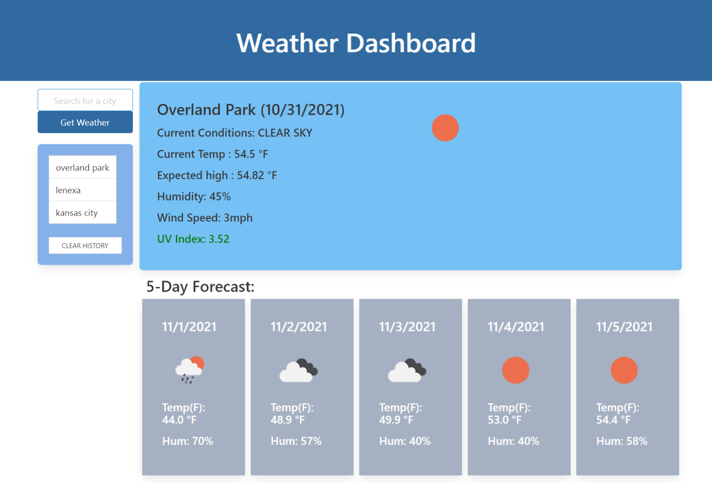

# weather-dashboard

# OBJECTIVE:

* Create a weather app using third party API so a traveler can plan a trip accordingly.  The weather should show current and 5 day forecast with UV Index.

# The following steps were taken to create this weather app.
* First started by creating a HTML doc giving basic layouts to program against.
* Next started to write the script file to retrieve the third party API to display requested information.
* Requested the API key to be able to retrieve the weather information.
* Began by first listing variables and writing the basic functions of retrieving requested city weather.
* Added the function of listing the most recent city weather that was visited.
* Next started writing out more of the HTML for placement of the different information to be displayed.
* Added functions for submitting the request and for clearing recent cities visited.
* Wrote the script for getting the current weather information on the city requested.
* Next wrote the script for getting the 5 day weather information on the city requested.
* Next made adjustments to the way the website displayed. 

# Below is the GitHub Pages published link and the GitHub Repository address:

https://bilcon.github.io/weather-dashboard/

https://github.com/bilcon/weather-dashboard

# Here is a screen shot of the webpage when deployed

